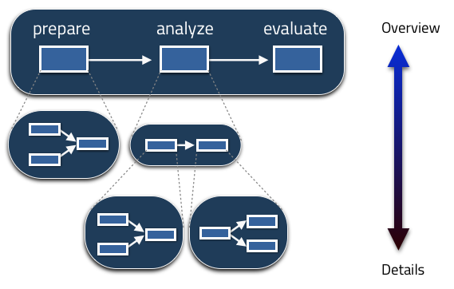
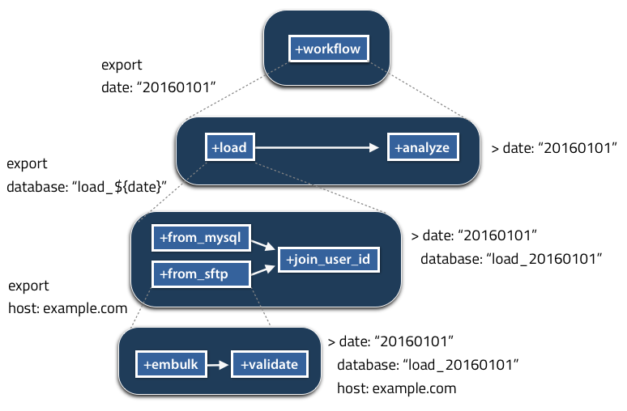
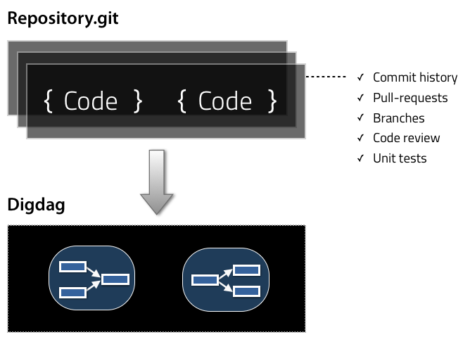

# アーキテクチャー

## Digdagによるワークフロー自動化

ワークフローはあらゆる種類の手動操作を自動化します。タスクの並びをワークフローとして定義するとDigdagはそれを実行します。タスクは演算子プラグインとして定義されワークフローエンジンの中心から種々のシステムをコントロールできます。(参照 [ビルドイン演算子プラグインリスト](operators.html)).

プラグインのランタイムフレームワークとしてDigdagは作業自動化周辺の問題を処理するので我々は自動化に専念できます。もしタスクが失敗するとDigdagはアラートを送信しますし、もしワークフローが想定時間内に終わらなければDigdagは通知を出します。またDigdagはスケジュールオプションに基づき自動的にワークフローを開始します。

タスクはローカルマシン、分散サーバー、またはDockerコンテナ上で稼働できます。

## グループごとにタスクをまとめる

複雑なワークフローを自動化する時、すぐに定義が難解になります。Digdagを使うことでタスクをグループにまとめる事が出来ます。定義をレビューする時、全景を見た上で、詳細にダイブ出来ます。それによりワークフロー開発中のデバッグやレビューを容易にします。運用環境では管理者が何が起こっているのかを把握し問題を解決するのを助けます。

もし依存する兄弟タスクが無い、又は全てのそれらが成功裏に完了していれば、タスクが開始します。グループの親タスクが動く時、その子タスクも動きます。全てのタスクが成功裏に完了すればそれらの親タスクも全て成功しています。しかし一つでも子タスクが失敗するとその子タスクとその親タスクが失敗となります。全体の実行はルートタスクが完了するか失敗した時に完了します。

### パラメータ

タスクのグルーピングはタスク間でパラメータを渡す為にも利用されます。親タスクは子タスクの為に変数をエクスポート(UNIXシェルの*export*コマンドが環境変数をセットする様に)できます。親タスクは実行時に子タスクを成績出来ますので前のタスクの結果に基づき異なるタスクを実行出来ます。詳細は[変数の定義](workflow_definition.html#defining-variables)セクションを参照下さい。

ワークフロー定義の構文は[ワークフロー定義](workflow_definition.html)セクションを参照下さい。

## ワークフロー・アズ・コード

Digdagワークフローはコードとして定義されます。これはソフト開発のベストプラクティス：バージョンコントロール、コードレビュー、テスト、プルリクエストでの共同作業、をもたらします。あなたがワークフローをGitリポジトリにプッシュする事で、誰もがそれをプルし同じ結果を再現出来るのです。

## ローカルモードでの実行

Digdagはシングルファイル実行可能コマンドです。新しいワークフローの作成と実行はMakefileと同じぐらい簡単です。
`*.dig`拡張子のファイルはワークフロー定義のためのファイルです。`digdag run my_workflow.dig`コマンドでワークフローは実行されます。
ワークフローをローカルマシンで開発しテストすればそれはサーバーにプッシュしワークフローを定期的に実行したくなるでしょう。

## サーバーでの実行

同じディレクトリの`*.dig`拡張子とその他のファイルは**プロジェクト**と呼ばれます。プロジェクト全体はDigdagサーバーにプッシュ出来、サーバー上でワークフローが実行されます。

### Docker上でのタスク実行

タスクをコンテナ内で実行するのに[Docker](https://www.docker.com/)が利用出来ます。もし`docker`オプションがセットされていれば、タスクはDockerコンテナ内で実行されます。

    _export:
      docker:
        image: ubuntu:14.04
    
    +step1:
      py>: tasks.MyWorkflow.step1

Digdagキャッシュはイメージをプルし、再利用します。現在デフォルトではもしイメージのアップデートがあってもDigdagは一貫してキャッシュされたイメージを利用します。`pull_always: true`オプションをセットすることでDigdagは毎回タスクを開始する際にアップデートをチェックし対象タグの最新イメージをプルします。

    _export:
      docker:
        image: ubuntu:latest
        pull_always: true
    
    +step1:
      py>: tasks.MyWorkflow.step1

## 次のステップ

* [コンセプト](concepts.html)
* [初めに](scheduling_workflow.html)
* [オペレーターの更なる選択肢](operators.html)

